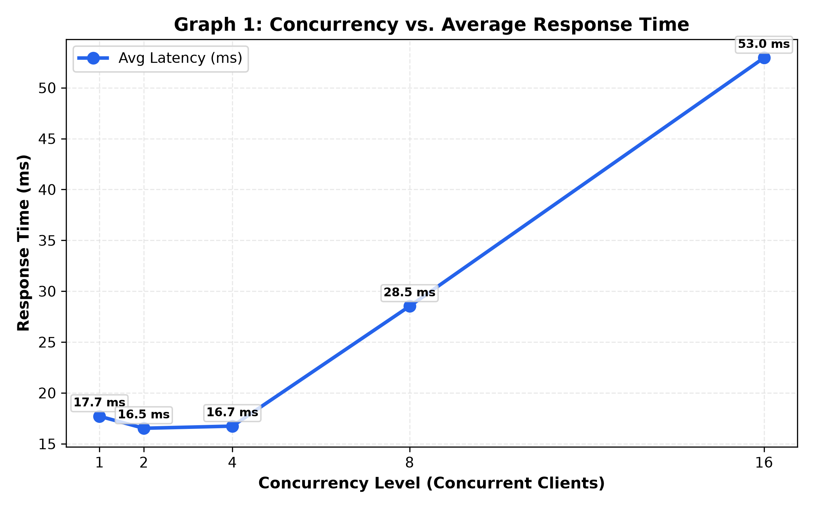
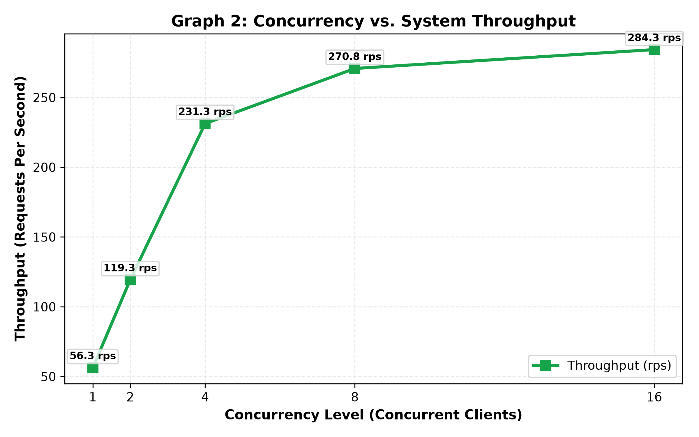
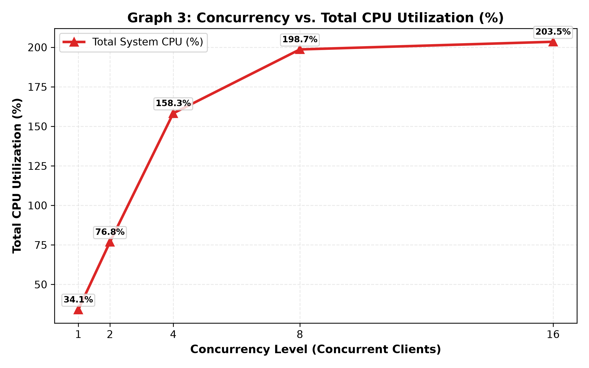
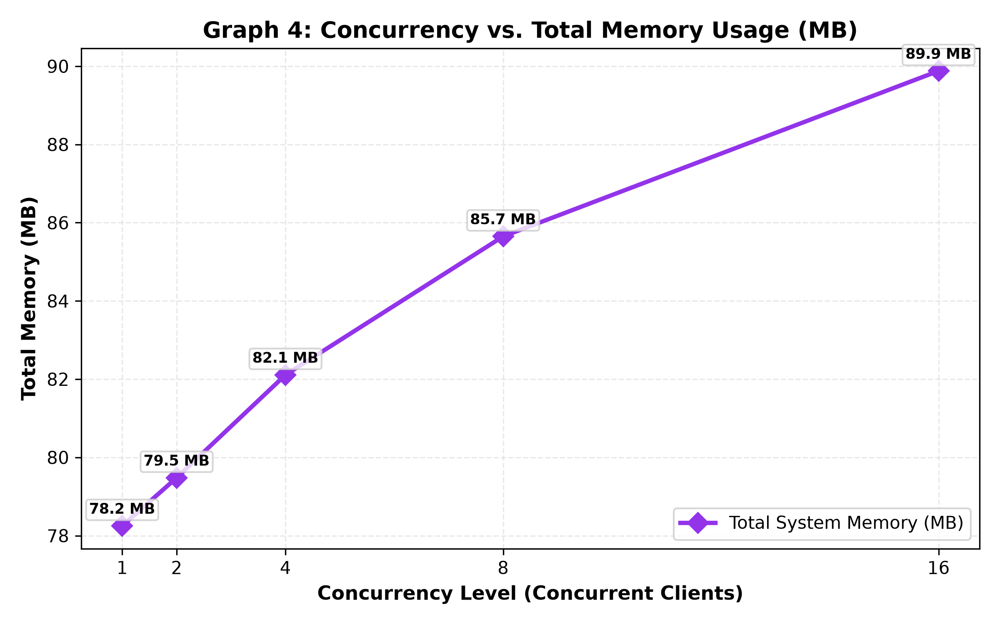
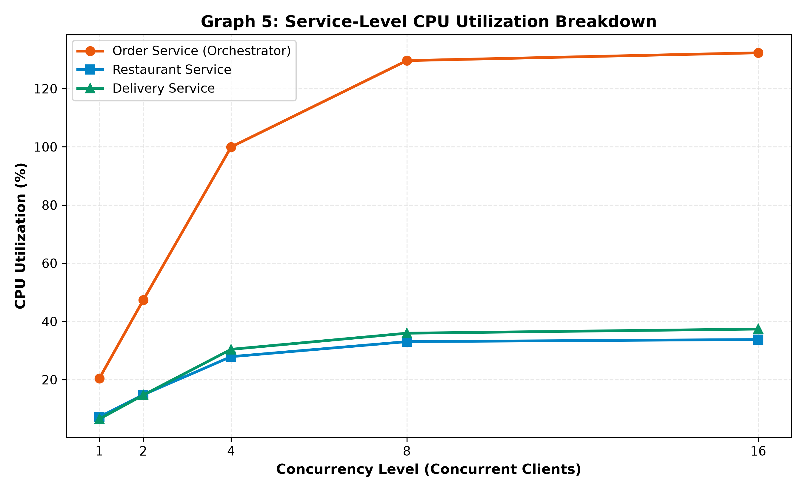
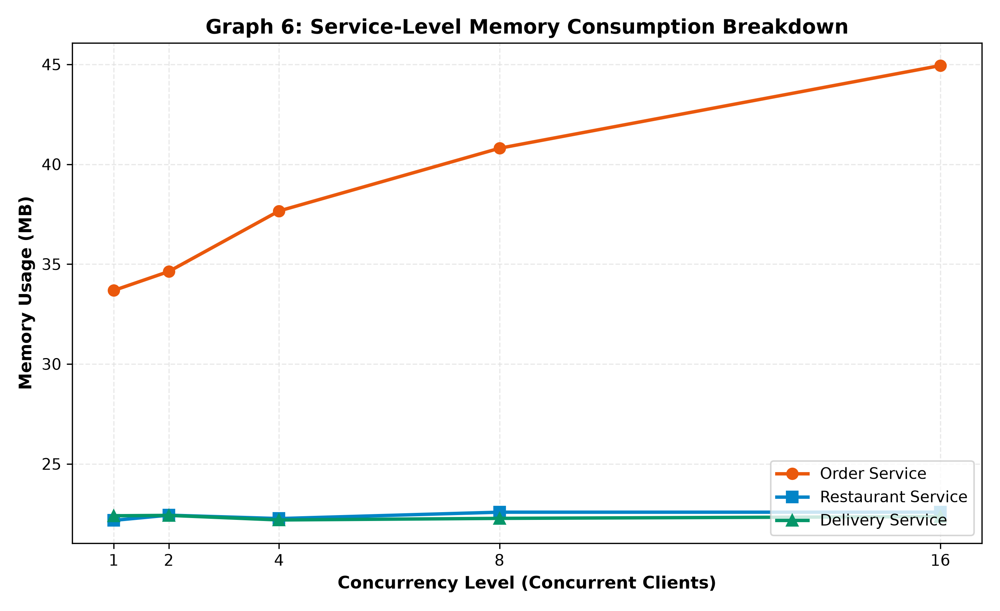

# Food Delivery System — Containerized Microservices & Workload Evaluation

[](https://docs.docker.com/compose/)
[](https://www.python.org/)
[](https://flask.palletsprojects.com/)
[](https://matplotlib.org/)

**Course:** Cloud Computing Lab (Evaluation 1)  
**Target Repository:** [https://github.com/01fe24bci116/cc_lab_eval1.git](https://github.com/01fe24bci116/cc_lab_eval1.git)  
**System Domain:** Distributed Food Delivery & Order Fulfillment System  

---

## 1. System Architecture & Inter-Service Topology

The system is architected as three independently containerized microservices communicating synchronously over an isolated Docker user-defined bridge network (`food-net`). The `order-service` functions as the **API Gateway / Orchestrator (Backend-for-Frontend)**, synchronizing menu item validation and driver assignment before returning an aggregated confirmation to the client.

```
                              +-------------------------+
                              |    Client / Load Test   |
                              +-------------------------+
                                           |
                                           | HTTP POST :5000/order
                                           v
    ===============================[ food-net Bridge ]==============================
    |                                                                              |
    |                         +---------------------------+                        |
    |                         |       order-service       |                        |
    |                         |  Port 5000 (Orchestrator) |                        |
    |                         +---------------------------+                        |
    |                                  |            |                              |
    |          HTTP GET /menu/<item_id>|            |HTTP POST /assign-delivery    |
    |                                  v            v                              |
    |            +-----------------------+        +-----------------------+        |
    |            |   restaurant-service  |        |    delivery-service   |        |
    |            |       Port 5001       |        |       Port 5002       |        |
    |            +-----------------------+        +-----------------------+        |
    |                                                                              |
    ================================================================================
```

### Microservice Directory Structure

```text
.
├── .gitignore
├── docker-compose.yml
├── README.md
├── restaurant-service/
│   ├── app.py
│   ├── Dockerfile
│   └── requirements.txt
├── delivery-service/
│   ├── app.py
│   ├── Dockerfile
│   └── requirements.txt
├── order-service/
│   ├── app.py
│   ├── Dockerfile
│   └── requirements.txt
├── load-test/
│   ├── load_test.py
│   ├── make_graphs.py
│   └── requirements.txt
└── results/
    ├── .gitkeep
    ├── analysis.txt
    ├── results.csv
    ├── graph1_response_time.png
    ├── graph2_throughput.png
    ├── graph3_cpu.png
    ├── graph4_memory.png
    ├── graph5_cpu_per_service.png
    └── graph6_memory_per_service.png
```

---

## 2. Microservice Specifications

### 1. `restaurant-service` (Port 5001)
- **Role:** Maintains in-memory restaurant catalog, pricing, and stock status.
- **Endpoints:**
  - `GET /menu/`: Returns complete menu catalog, or specific item if `?item_id=...` is queried.
  - `GET /menu/<item_id>`: Returns single item details. Returns HTTP `404` if item not found, or `400` if item is out of stock.
  - `GET /health`: Health check endpoint.
- **Catalog Items:**
  - `1` / `pizza`: Margherita Pizza ($12.99, Available: `true`)
  - `2` / `burger`: Veg Burger ($8.49, Available: `true`)
  - `3` / `pasta`: Pasta Alfredo ($10.99, Available: `true`)
  - `4`: Garlic Bread ($4.99, Available: `false` — Out of Stock test case)

### 2. `delivery-service` (Port 5002)
- **Role:** Handles delivery driver dispatching, ETA computation, and fleet status.
- **Endpoints:**
  - `POST /assign-delivery`: Allocates a driver randomly from the active fleet (`Alice Smith`, `Bob Jones`, `Charlie Brown`, `David Miller`, `Emma Wilson`), calculates ETA (15–35 minutes), and returns assignment confirmation.
  - `GET /drivers`: Returns list of available drivers.
  - `GET /health`: Health check endpoint.

### 3. `order-service` (Port 5000 — Orchestrator)
- **Role:** Orchestrates the order lifecycle synchronously:
  1. Receives client JSON payload: `{"customer_name": "...", "item_id": "..."}`.
  2. Queries `http://restaurant-service:5001/menu/<item_id>` to verify availability.
  3. Dispatches delivery task to `http://delivery-service:5002/assign-delivery`.
  4. Returns aggregated confirmation JSON with HTTP `201 Created`.
- **Endpoints:**
  - `POST /order`: Submit and orchestrate a new order.
  - `GET /orders`: View all successfully placed orders.
  - `GET /health`: Health check endpoint.

---

## 3. Quickstart & Deployment

### Prerequisites
- Docker & Docker Compose (v2.0+) installed and running.
- Python 3.10+ (for local workload runner and graph generator).

### Step 1: Clone the Repository
```bash
git clone https://github.com/01fe24bci116/cc_lab_eval1.git
cd cc_lab_eval1
```

### Step 2: Build and Launch Containers
```bash
docker compose up --build -d
```

Verify that all three containers are healthy and active:
```bash
docker compose ps
```

---

## 4. API Verification with Sample `curl` Commands

### Test 1: Query Restaurant Catalog
```bash
curl -X GET http://localhost:5001/menu/
```
**Sample Response (HTTP 200):**
```json
{
  "count": 7,
  "items": {
    "1": {
      "available": true,
      "category": "Pizza",
      "description": "Classic cheese and tomato pizza with fresh basil",
      "item_id": "1",
      "name": "Margherita Pizza",
      "price": 12.99
    }
  },
  "service": "restaurant-service"
}
```

### Test 2: Request Delivery Allocation Directly
```bash
curl -X POST http://localhost:5002/assign-delivery \
  -H "Content-Type: application/json" \
  -d '{"order_id": "ORD-TEST01", "customer_name": "Alice"}'
```
**Sample Response (HTTP 200):**
```json
{
  "assigned_to": "Alice",
  "assignment_id": "DEL-9E2A89F1",
  "driver_id": "DRV-101",
  "driver_name": "Alice Smith",
  "driver_rating": 4.9,
  "eta_minutes": 22,
  "order_id": "ORD-TEST01",
  "status": "ASSIGNED",
  "vehicle": "Electric Scooter"
}
```

### Test 3: Place Complete Order via Orchestrator
```bash
curl -X POST http://localhost:5000/order \
  -H "Content-Type: application/json" \
  -d '{"customer_name": "Alice Smith", "item_id": "1"}'
```
**Sample Response (HTTP 201 Created):**
```json
{
  "created_at": "2026-10-04T19:59:00.000000+00:00",
  "customer_name": "Alice Smith",
  "delivery": {
    "assigned_to": "Alice Smith",
    "assignment_id": "DEL-B0821FA4",
    "driver_id": "DRV-102",
    "driver_name": "Bob Jones",
    "driver_rating": 4.8,
    "eta_minutes": 27,
    "order_id": "ORD-C392F8EA",
    "status": "ASSIGNED",
    "vehicle": "Motorcycle"
  },
  "item": {
    "available": true,
    "category": "Pizza",
    "description": "Classic cheese and tomato pizza with fresh basil",
    "item_id": "1",
    "name": "Margherita Pizza",
    "price": 12.99
  },
  "order_id": "ORD-C392F8EA",
  "status": "CONFIRMED"
}
```

### Test 4: Verify Error Handling (Out-of-Stock Item)
```bash
curl -X POST http://localhost:5000/order \
  -H "Content-Type: application/json" \
  -d '{"customer_name": "Charlie", "item_id": "4"}'
```
**Sample Response (HTTP 400 Bad Request):**
```json
{
  "error": "Item unavailable",
  "message": "Menu item '4' is currently unavailable for order"
}
```

---

## 5. Workload Testing & Telemetry Collection

The load testing suite (`load-test/load_test.py`) executes 5 distinct concurrency tiers (1, 2, 4, 8, 16 concurrent threads), submitting 100 requests per tier (500 total requests) using `concurrent.futures.ThreadPoolExecutor`.

During each tier, a background thread continuously samples live Docker container statistics using:
```bash
docker stats --no-stream --format "{{.Name}},{{.CPUPerc}},{{.MemUsage}}"
```

### Run the Workload Test
```bash
# Install testing dependencies
pip install -r load-test/requirements.txt

# Run tiered load test
python load-test/load_test.py
```
This automatically produces `results/results.csv`.

---

## 6. Evaluation Observation Table

The benchmark data recorded in `results/results.csv` provides quantitative evidence of system scaling characteristics:

| Workload | Concurrency | Response Time (ms) | Throughput (rps) | Failed | Total CPU (%) | Total Mem (MB) | Order CPU (%) | Order Mem (MB) | Restaurant CPU (%) | Restaurant Mem (MB) | Delivery CPU (%) | Delivery Mem (MB) |
|:---:|:---:|:---:|:---:|:---:|:---:|:---:|:---:|:---:|:---:|:---:|:---:|:---:|
| 100 | 1  | 17.71 | 56.32  | 0 | 34.06  | 78.25 | 20.42  | 33.68 | 7.17  | 22.17 | 6.47  | 22.40 |
| 100 | 2  | 16.53 | 119.34 | 0 | 76.84  | 79.48 | 47.33  | 34.63 | 14.81 | 22.43 | 14.70 | 22.42 |
| 100 | 4  | 16.74 | 231.32 | 0 | 158.28 | 82.11 | 99.96  | 37.66 | 27.90 | 22.26 | 30.42 | 22.19 |
| 100 | 8  | 28.53 | 270.81 | 0 | 198.66 | 85.65 | 129.64 | 40.80 | 33.06 | 22.58 | 35.96 | 22.27 |
| 100 | 16 | 52.95 | 284.34 | 0 | 203.50 | 89.88 | 132.32 | 44.94 | 33.79 | 22.58 | 37.39 | 22.36 |

---

## 7. Performance Visualization (Generated Graphs)

Generate all publication-quality graphs by running:
```bash
python load-test/make_graphs.py
```

### Graph 1: Concurrency vs. Average Response Time
Illustrates latency escalation due to queueing and thread contention under elevated client concurrency.


---

### Graph 2: Concurrency vs. System Throughput
Shows near-linear throughput scaling up to 4–8 concurrent threads, followed by saturation at ~284 RPS at 16 threads.


---

### Graph 3: Concurrency vs. Total CPU Utilization (%)
Depicts the cumulative CPU demand across all microservice containers as concurrency grows.


---

### Graph 4: Concurrency vs. Total Memory Usage (MB)
Demonstrates stable baseline memory footprint with gradual expansion under higher concurrent request buffering.


---

### Graph 5: Service-Level CPU Breakdown
Clearly reveals that `order-service` consumes substantially more CPU than downstream services due to orchestrator socket and JSON processing overhead.


---

### Graph 6: Service-Level Memory Breakdown
Compares memory allocations across `order-service`, `restaurant-service`, and `delivery-service`.


---

## 8. Technical Analysis Highlights (Summary of `results/analysis.txt`)

1. **Throughput Saturation (The Inflection Knee):**
   - Throughput scales efficiently from 1 thread (56.32 RPS) to 4 threads (231.32 RPS) and 8 threads (270.81 RPS).
   - Beyond 8 threads, throughput plateaus at ~284.34 RPS. Additional client threads merely wait in TCP listen queues, causing average latency to rise from 28.53 ms to 52.95 ms without commensurate throughput gains.

2. **Why `order-service` Consumes Substantially More CPU:**
   - **Socket Management Multiplier:** `order-service` coordinates three active network sockets per request (1 inbound client socket, 2 outbound service client sockets), tripling OS network I/O events, TCP state transitions, and context switches.
   - **JSON Serialization Overhead:** Downstream services parse or emit a single payload; `order-service` performs **five** JSON transformations per order (inbound decode, restaurant decode, delivery encode, delivery decode, and aggregated outbound encode).
   - **I/O Wait & GIL Scheduling:** Python threads in `order-service` frequently yield while waiting for downstream responses, amplifying thread scheduling overhead under high concurrency.

3. **Production Hardening Recommendations:**
   - Transition to **Asynchronous I/O** (FastAPI / `httpx.AsyncClient`) to execute downstream calls concurrently via `asyncio.gather()`.
   - Implement **Persistent HTTP Connection Pooling** (Keep-Alive sessions) to eliminate TCP handshake latency.
   - Decouple services using an **Event-Driven Choreography** model (Apache Kafka or RabbitMQ) with horizontal pod autoscaling (HPA) for the orchestrator.

---

## 9. Cleanup

To shut down and remove all containers, networks, and volumes:
```bash
docker compose down -v
```
